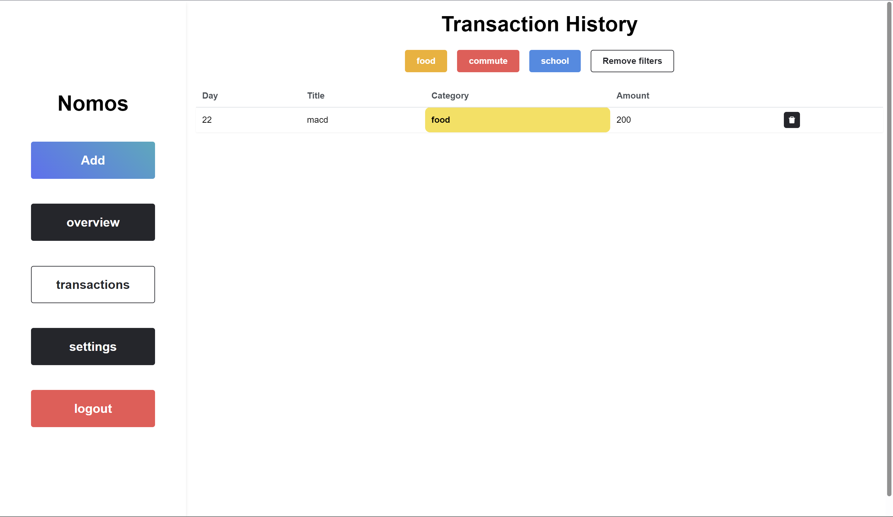

<p align="center">
<h1>Nomos</h1>
<i>track your expenses</i>
</p>


## Features
- User Authentication: Securely log in and manage your expenses with NextAuth for user authentication.
- Expense Tracking: Easily add, edit, and categorize your expenses to keep a detailed record of your spending.
- Budget Management: Set monthly budgets.
- Data Storage: Store your expense data reliably and efficiently using CockroachDB and Prisma.
- Real-time Updates: Experience real-time updates and data synchronization with React Query.

## Tech Stack
Nomos is built using the following technologies:

- Next.js: A React framework for building server-rendered React applications.
- Tailwind CSS: A utility-first CSS framework for quickly designing and styling your application.
- NextAuth: Provides authentication for Next.js applications with various authentication providers.
- CockroachDB: A distributed SQL database designed for global cloud services.
- tRPC: A TypeScript-first, framework-agnostic framework for building APIs.
- Prisma: A modern database toolkit for Node.js and TypeScript.
- React Query: A data-fetching library for React applications that synchronizes data seamlessly.

  Follow these steps to set up and run Nomos on your local machine:

## Developing Locally
- Clone the repository:
```bash
git clone https://github.com/probablyarth/nomos.git
```
- Install the dependencies:
```bash
cd nomos
yarn
```
- Configure your environment variables. You'll need to set up environment variables for database connection and authentication. Refer to the `.env.example` file for reference.
- Run the development server:
```bash
yarn dev
```
- Access Nomos in your web browser at http://localhost:3000.
